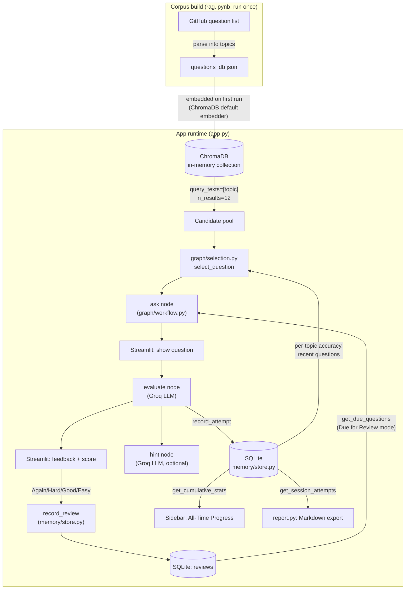

# Design

Architecture and data model for Java Interview Coach. See [README.md](README.md) for setup.

## Architecture overview

Two pipelines feed into a Streamlit UI that drives a LangGraph-style workflow one button
click at a time.



### RAG pipeline

- `rag.ipynb` fetches the raw question list from a public GitHub README, regex-parses its
  Markdown tables into `{topic: [questions]}`, and writes `questions_db.json` (1,715
  questions across ~27 topics). This step needs network access and is run once, by hand.
- `app.py`'s `load_vector_db()` (`@st.cache_resource`) opens a `chromadb.Client()` — an
  **ephemeral, in-memory** client, not a client backed by a persisted directory — and, if
  the collection is empty, loads all of `questions_db.json` into it in batches of 100 using
  Chroma's default embedding function (`all-MiniLM-L6-v2`, ONNX). This means the "vector
  store build" actually happens at Streamlit startup from the JSON file, every process
  restart; `rag.ipynb` is only responsible for producing that JSON file, not for building a
  durable Chroma index.
- Retrieval is a plain semantic `collection.query(query_texts=[topic], n_results=12)` in
  `graph/workflow.py:retrieve_candidates` — the topic label itself is the query string.

### LangGraph workflow

`graph/state.py` defines `InterviewState` (a `TypedDict`): topic, current question, user
answer, feedback, score, weak topics, hint, session id, etc.

`graph/workflow.py` builds four nodes via factories that close over the Chroma collection
and the Groq LLM (`make_ask_question_node`, `make_evaluate_node`, `make_hint_node`,
`end_node`):

- **ask** — retrieves the RAG candidate pool for the topic, then calls
  `graph/selection.py:select_question` to pick one from that pool (see below).
- **evaluate** — sends the question + user answer to Groq with a prompt asking for
  CORRECT/INCORRECT, brief feedback, and an ideal answer; updates score/weak topics; calls
  `memory.store.record_attempt` to persist the attempt.
- **hint** — asks Groq for a short hint that doesn't give away the answer.
- **end** — terminal no-op, used only by the compiled graph.

`build_graph()` also compiles these into a real `StateGraph` (`ask -> evaluate ->
(hint | ask | end)` via a `router` on `state["next_action"]`) for programmatic/CLI-style use.
**`app.py` itself does not drive this compiled graph** — it calls the individual node
functions returned by `build_nodes()` directly, one per Streamlit button click ("Generate
Question" -> `ask`, "Submit Answer" -> `evaluate`, "Get Hint" -> `hint`), because Streamlit's
rerun-on-interaction model is a more natural fit for turn-by-turn node calls than driving one
long-lived graph invocation.

### Difficulty-adaptive selection

`graph/selection.py` sits between RAG retrieval and the `ask` node — it doesn't replace
retrieval, it re-ranks the pool retrieval already returned:

1. `estimate_difficulty(question)` — a heuristic 0..1 proxy, not a labeled ground truth:
   longer questions score higher, phrasing like "difference between", "internally", "why",
   "trade-off" pushes the score up, and phrasing like "what is", "define" pulls it down.
2. `select_question` looks up the user's saved accuracy for the topic
   (`store.get_topic_stats`). With fewer than 3 recorded attempts on that topic, it targets a
   fixed easy-ish default (0.35) instead of trusting a noisy accuracy signal. Otherwise it
   targets the user's current accuracy directly — better accuracy pulls in harder questions.
3. Candidates asked recently for that topic (`store.get_recent_questions`, last 15) are
   filtered out first, falling back to the full pool if everything was asked recently.
4. The remaining candidates are sorted by closeness to the target difficulty; a question is
   picked at random from the closer half, so the same accuracy level doesn't always produce
   the exact same question.

`pick_topic_for_auto_mode` does the analogous thing one level up, for the "Auto (focus on my
weak topics)" selector: topics are sampled with `weight = max(0.15, 1 - accuracy)`, so
topics the user gets wrong more often come up more often, with unseen topics getting a
flat, reasonably high weight (0.7) instead of being ignored.

### Persistence (SQLite)

`memory/store.py` uses the stdlib `sqlite3` module (no ORM) against a single file,
`interview_history.db`, at the project root (created on first use, gitignored).

```sql
sessions(id TEXT PRIMARY KEY, started_at TEXT)

attempts(id INTEGER PRIMARY KEY AUTOINCREMENT,
         session_id TEXT REFERENCES sessions(id),
         topic TEXT, question TEXT, answer TEXT, feedback TEXT,
         is_correct INTEGER, created_at TEXT)
-- indexes on attempts(topic) and attempts(session_id)

reviews(id INTEGER PRIMARY KEY AUTOINCREMENT,
        topic TEXT, question TEXT, rating TEXT,
        next_review_at TEXT, updated_at TEXT,
        UNIQUE(topic, question))
-- index on reviews(next_review_at)
```

- `start_session()` inserts a row into `sessions` and hands the UUID to `st.session_state`
  for the process lifetime.
- `record_attempt(...)` inserts one row into `attempts` per evaluated answer.
- `get_topic_stats()` — `SUM(is_correct) / COUNT(*)` grouped by topic, across **all**
  sessions ever recorded; this is what feeds difficulty adaptation and auto-topic weighting.
- `get_cumulative_stats()` — total questions/correct/sessions, plus the three lowest-accuracy
  topics with at least 2 attempts (ties broken toward the topic practiced more) — this
  drives the sidebar's "All-Time Progress" block.
- `get_recent_questions()` / `get_session_attempts()` back the anti-repeat filter and the
  Markdown report (`report.py`), respectively.

### Spaced repetition (round 2)

A `reviews` table, keyed one row per `(topic, question)` (`UNIQUE(topic, question)`,
upserted via `ON CONFLICT`), tracks a simple fixed-interval schedule — deliberately not a
full Anki-style ease-factor algorithm, "similar in spirit to a standard SRS" per the spec
rather than a reimplementation of one:

- After seeing feedback, the user rates their confidence: **Again** (1 day), **Hard**
  (3 days), **Good** (7 days), **Easy** (14 days) — `store.RATING_INTERVALS_DAYS`.
- `store.record_review(topic, question, rating)` upserts that question's `next_review_at`
  to `now + interval`. Re-rating a question later overwrites its schedule; only the most
  recent rating is kept, since only the *next* due date matters for scheduling.
- `store.get_due_questions()` returns rows where `next_review_at <= now`, most-overdue
  first, optionally scoped to one topic.
- In `app.py`, a **"🔁 Due for Review"** entry in the topic selector bypasses RAG retrieval
  and `graph/selection.py` entirely — it's not a topic being searched, it's a specific
  already-known question being resurfaced — and pulls the single most-overdue row from
  `get_due_questions()` directly. If nothing is due, the UI says so instead of showing a
  question. Rating buttons (`RATING_LABELS`) appear under feedback for every question
  regardless of mode, so any question — RAG-selected or due-for-review — feeds the same
  schedule.

## Notebooks vs. real modules

| Still notebook-only | Promoted to a real module |
|---|---|
| `rag.ipynb` — fetches/parses the question corpus into `questions_db.json`. Must be run by hand once (or whenever the corpus should be refreshed); nothing in `app.py` regenerates it. | `graph/state.py`, `graph/workflow.py` — the LangGraph state and node/graph wiring described above, imported directly by `app.py`. |
| `main.ipynb` — original exploratory notebook for the ask→evaluate chain (uses a plain per-call `question_chain`, no RAG, no persistence, no difficulty adaptation). Superseded by the app; kept for reference only, not imported anywhere. | `graph/selection.py` — difficulty-adaptive ranking, used by `workflow.py`'s `ask` node. |
| `graph/state.ipynb`, `graph/workflow.ipynb` — earlier sketches of the same state/workflow shape; `graph/state.py` and `graph/workflow.py` are the promoted, actually-imported versions. | `memory/store.py` — SQLite persistence, used by `workflow.py`, `selection.py`, `app.py`, and `report.py`. |

## Tests

`tests/test_store.py` and `tests/test_selection.py` are real `pytest` tests (40 total, all
passing as of this writing — run `uv run pytest tests/ -v` to reproduce), added in round 2.
They replace round 1's manual-script verification for these two modules:

- `test_store.py` exercises `memory/store.py` end to end against a fresh temp SQLite file
  per test (`tmp_path`, via the `db_path` parameter every `store` function already accepts)
  — session creation, attempt recording, cumulative/topic accuracy math, weakest-topic
  ordering and the >=2-attempts threshold, the recent-questions anti-repeat query, and the
  spaced-repetition schedule (interval-per-rating, upsert-on-rerate, due-question filtering/
  ordering/limit, per-topic scoping).
- The "Due for Review" mode's Streamlit wiring in `app.py` (`_next_question`, the rating
  buttons) was smoke-tested with Streamlit's `AppTest` harness — selecting the mode,
  generating a question, seeding an overdue `reviews` row and confirming it surfaces, and
  clicking a rating button and confirming the DB row lands with the right `next_review_at`
  — but isn't part of the `pytest tests/` suite (it needs a `GROQ_API_KEY`, even a dummy one,
  just to construct `ChatGroq`, and a `questions_db.json` fixture) so it isn't a committed,
  repeatable test file, just a design-time verification.
- `test_selection.py` exercises `graph/selection.py`'s difficulty heuristic, the
  target-difficulty logic (default 0.35 under 3 attempts vs. accuracy-driven above it), the
  recently-asked filter and its fall-back-to-full-pool behavior, and `pick_topic_for_auto_mode`'s
  weighting. No ChromaDB client is created or mocked for these — `selection.py` never imports
  `chromadb` itself; it operates purely on the `list[str]` of candidates the caller already
  retrieved, so the tests just build that list as a fixture directly.
- Neither test file requires `GROQ_API_KEY`, network access, or `questions_db.json`.

## Known limitations

- **Not tested against a live Groq key in this environment.** `evaluate` and `hint` both
  require `GROQ_API_KEY` and a network call to Groq; nothing here exercised that path — only
  `python3 -m py_compile` and static reading of the code were verified.
- **Ephemeral vector store.** `chromadb.Client()` is in-memory only; every fresh process
  re-embeds all 1,715 questions from `questions_db.json` at startup (cheap, but not
  persisted to disk as a Chroma index).
- **`questions_db.json` is required but gitignored.** `rag.ipynb` must be run once before
  `app.py` will start — `load_vector_db()` will raise `FileNotFoundError` otherwise.
- **`requirements.txt` is stale relative to `pyproject.toml`/`uv.lock`** — it's missing
  `streamlit` and `langchain-groq`, both of which `app.py` imports directly. `uv sync`
  (which reads `pyproject.toml`) is the reliable install path; `requirements.txt` should not
  be relied on as-is.
- **Difficulty is a heuristic proxy**, not a labeled difficulty from the source data — see
  `graph/selection.py:estimate_difficulty`'s docstring.
- **`app.py` calls workflow nodes directly**, not the compiled `build_graph()` state
  machine — the compiled graph exists and is testable, but isn't the code path Streamlit
  actually runs.
