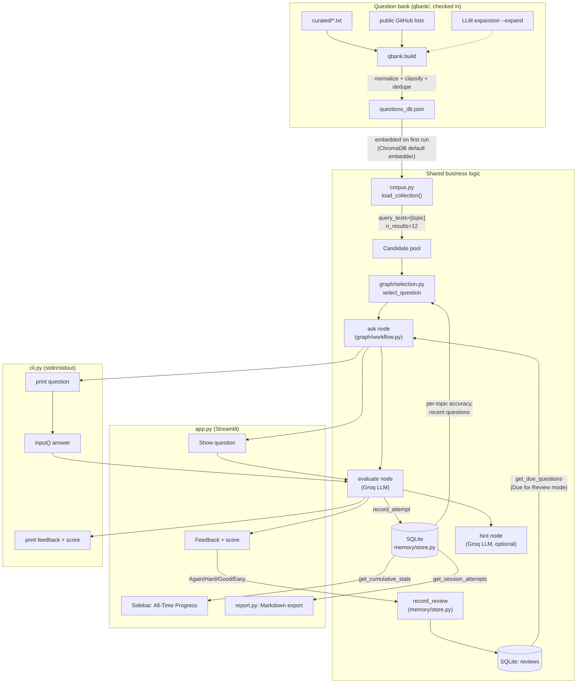

# Design

Architecture and data model for Java Interview Coach. See [README.md](README.md) for setup.

## Architecture overview

Two pipelines feed into three interchangeable front-ends (Streamlit's `app.py`, `cli.py`'s
stdin loop, or the `mcp_server/` MCP tools) that each drive the exact same LangGraph-style
workflow — one button click, one `input()` call, or one tool call, at a time.



### RAG pipeline

- The question bank (`questions_db.json`, `{topic: [questions]}`, ~2,500 questions across
  the 10 canonical topics) is **built by `qbank/` and checked in** — see "Question-bank
  pipeline" below. `rag.ipynb` is now a thin wrapper that shells out to `python -m
  qbank.build`.
- `app.py`'s `load_vector_db()` (`@st.cache_resource`) opens a `chromadb.Client()` — an
  **ephemeral, in-memory** client, not a client backed by a persisted directory — and, if
  the collection is empty, loads all of `questions_db.json` into it in batches of 100 using
  Chroma's default embedding function (`all-MiniLM-L6-v2`, ONNX). This means the "vector
  store build" actually happens at Streamlit startup from the JSON file, every process
  restart; `rag.ipynb` is only responsible for producing that JSON file, not for building a
  durable Chroma index.
- Retrieval is a plain semantic `collection.query(query_texts=[topic], n_results=12)` in
  `graph/workflow.py:retrieve_candidates` — the topic label itself is the query string.

### LangGraph workflow

`graph/state.py` defines `InterviewState` (a `TypedDict`): topic, current question, user
answer, feedback, score, weak topics, hint, session id, etc.

`graph/workflow.py` builds four nodes via factories that close over the Chroma collection
and the Groq LLM (`make_ask_question_node`, `make_evaluate_node`, `make_hint_node`,
`end_node`):

- **ask** — retrieves the RAG candidate pool for the topic, then calls
  `graph/selection.py:select_question` to pick one from that pool (see below).
- **evaluate** — sends the question + user answer to Groq with a prompt asking for
  CORRECT/INCORRECT, brief feedback, and an ideal answer; updates score/weak topics; calls
  `memory.store.record_attempt` to persist the attempt.
- **hint** — asks Groq for a short hint that doesn't give away the answer.
- **end** — terminal no-op, used only by the compiled graph.

`build_graph()` also compiles these into a real `StateGraph` (`ask -> evaluate ->
(hint | ask | end)` via a `router` on `state["next_action"]`) for programmatic/CLI-style use.
**`app.py` itself does not drive this compiled graph** — it calls the individual node
functions returned by `build_nodes()` directly, one per Streamlit button click ("Generate
Question" -> `ask`, "Submit Answer" -> `evaluate`, "Get Hint" -> `hint`), because Streamlit's
rerun-on-interaction model is a more natural fit for turn-by-turn node calls than driving one
long-lived graph invocation.

### Difficulty-adaptive selection

`graph/selection.py` sits between RAG retrieval and the `ask` node — it doesn't replace
retrieval, it re-ranks the pool retrieval already returned:

1. `estimate_difficulty(question)` — a heuristic 0..1 proxy, not a labeled ground truth:
   longer questions score higher, phrasing like "difference between", "internally", "why",
   "trade-off" pushes the score up, and phrasing like "what is", "define" pulls it down.
2. `select_question` looks up the user's saved accuracy for the topic
   (`store.get_topic_stats`). With fewer than 3 recorded attempts on that topic, it targets a
   fixed easy-ish default (0.35) instead of trusting a noisy accuracy signal. Otherwise it
   targets the user's current accuracy directly — better accuracy pulls in harder questions.
3. Candidates asked recently for that topic (`store.get_recent_questions`, last 15) are
   filtered out first, falling back to the full pool if everything was asked recently.
4. The remaining candidates are sorted by closeness to the target difficulty; a question is
   picked at random from the closer half, so the same accuracy level doesn't always produce
   the exact same question.

`pick_topic_for_auto_mode` does the analogous thing one level up, for the "Auto (focus on my
weak topics)" selector: topics are sampled with `weight = max(0.15, 1 - accuracy)`, so
topics the user gets wrong more often come up more often, with unseen topics getting a
flat, reasonably high weight (0.7) instead of being ignored.

### Persistence (SQLite)

`memory/store.py` uses the stdlib `sqlite3` module (no ORM) against a single file,
`interview_history.db`, at the project root (created on first use, gitignored).

```sql
sessions(id TEXT PRIMARY KEY, started_at TEXT)

attempts(id INTEGER PRIMARY KEY AUTOINCREMENT,
         session_id TEXT REFERENCES sessions(id),
         topic TEXT, question TEXT, answer TEXT, feedback TEXT,
         is_correct INTEGER, created_at TEXT)
-- indexes on attempts(topic) and attempts(session_id)

reviews(id INTEGER PRIMARY KEY AUTOINCREMENT,
        topic TEXT, question TEXT, rating TEXT,
        next_review_at TEXT, updated_at TEXT,
        UNIQUE(topic, question))
-- index on reviews(next_review_at)
```

- `start_session()` inserts a row into `sessions` and hands the UUID to `st.session_state`
  for the process lifetime.
- `record_attempt(...)` inserts one row into `attempts` per evaluated answer.
- `get_topic_stats()` — `SUM(is_correct) / COUNT(*)` grouped by topic, across **all**
  sessions ever recorded; this is what feeds difficulty adaptation and auto-topic weighting.
- `get_cumulative_stats()` — total questions/correct/sessions, plus the three lowest-accuracy
  topics with at least 2 attempts (ties broken toward the topic practiced more) — this
  drives the sidebar's "All-Time Progress" block.
- `get_recent_questions()` / `get_session_attempts()` back the anti-repeat filter and the
  Markdown report (`report.py`), respectively.

### Spaced repetition (round 2)

A `reviews` table, keyed one row per `(topic, question)` (`UNIQUE(topic, question)`,
upserted via `ON CONFLICT`), tracks a simple fixed-interval schedule — deliberately not a
full Anki-style ease-factor algorithm, "similar in spirit to a standard SRS" per the spec
rather than a reimplementation of one:

- After seeing feedback, the user rates their confidence: **Again** (1 day), **Hard**
  (3 days), **Good** (7 days), **Easy** (14 days) — `store.RATING_INTERVALS_DAYS`.
- `store.record_review(topic, question, rating)` upserts that question's `next_review_at`
  to `now + interval`. Re-rating a question later overwrites its schedule; only the most
  recent rating is kept, since only the *next* due date matters for scheduling.
- `store.get_due_questions()` returns rows where `next_review_at <= now`, most-overdue
  first, optionally scoped to one topic.
- In `app.py`, a **"🔁 Due for Review"** entry in the topic selector bypasses RAG retrieval
  and `graph/selection.py` entirely — it's not a topic being searched, it's a specific
  already-known question being resurfaced — and pulls the single most-overdue row from
  `get_due_questions()` directly. If nothing is due, the UI says so instead of showing a
  question. Rating buttons (`RATING_LABELS`) appear under feedback for every question
  regardless of mode, so any question — RAG-selected or due-for-review — feeds the same
  schedule.

### CLI practice mode (round 2)

`corpus.py` was extracted from `app.py` (the in-memory ChromaDB embed-on-first-use logic,
byte-for-byte the same, just no longer wrapped in `@st.cache_resource`) so both UIs load
the corpus the same way instead of `app.py` owning that step. `cli.py` then builds on top
of exactly the same pieces `app.py` does — `graph.selection.pick_topic_for_auto_mode`,
`graph.workflow.build_nodes` (so `graph/state.py`'s `InterviewState` shape and the
`ask`/`evaluate` nodes), and `memory.store` for persistence — and drives them from a plain
stdin/stdout loop instead of Streamlit button clicks. A CLI session and a Streamlit session
share the same `interview_history.db`, so difficulty adaptation, weak-topic weighting, and
cumulative stats carry over between the two.

`cli.py` constructs `ChatGroq` itself (inside `main()`, not at import time, unlike
`app.py`) so the failure point stays precise: retrieval/selection needs no API key at all,
and only the `evaluate` node's actual network call does. See Known limitations below for
exactly how far this was verified to run in this environment.

### MCP server (round 3)

`mcp_server/` exposes the coach over the [Model Context Protocol](https://modelcontextprotocol.io)
as a third front-end alongside Streamlit and the CLI, so any MCP client (Claude Desktop,
Claude Code, Cursor, VS Code) can run mock interviews using the same retrieval, grading,
persistence, and spaced-repetition logic.

- **Layering.** `mcp_server/tools.py` is the tool logic as plain functions with heavy
  dependencies passed in (`collection`, `llm`, `db_path`). It imports only `memory.store`
  and `topics` at module level — deliberately *not* `graph.workflow` (which pulls the whole
  LangChain/LangGraph chain) or `chromadb` or `mcp`. The 3-line RAG `query` call and the
  evaluate/hint prompt text are inlined / moved to `prompts.py` so the module stays light.
  Result: all nine tools are unit-tested with just `pytest` + a temp SQLite file + a fake
  collection / fake LLM (`tests/test_mcp_tools.py`).
- **Wire layer.** `mcp_server/server.py` is the only file that imports `mcp`. It wraps each
  `tools.py` function with `@mcp.tool()`, adds three resources
  (`interview://topics`, `interview://progress`, `interview://question-bank/{topic}`) and a
  `mock_interview` prompt, and owns the lazily-built ChromaDB collection and `ChatGroq`
  client — so `list_tools` and the store-backed tools respond instantly and a missing
  `GROQ_API_KEY` only surfaces (as a clear `RuntimeError`) if a grading tool is actually
  called.
- **Transports.** `python -m mcp_server` runs stdio (local clients); `--http` runs
  FastMCP's streamable-HTTP on `MCP_HOST`/`MCP_PORT` (default `127.0.0.1:8000/mcp`) for a
  hosted deployment. Both were smoke-tested with a real MCP client handshake.
- **Sessions.** MCP tool calls are stateless, so `evaluate_answer` only records an attempt
  when the caller threads through a `session_id` from `start_session` (plus a `topic`).
  Without them it still grades, just doesn't persist — the `mock_interview` prompt tells the
  client to always pass them.
- **`mcp` version.** Pinned to `>=1.6,<2`: v2.x renamed `FastMCP` to `MCPServer` and
  changed the API, and the v1 `FastMCP` surface is what current client docs and examples
  assume.

`topics.py` and `prompts.py` were extracted in this round so the CLI, the workflow graph,
and the MCP server share one topic list and one set of prompt strings instead of three
copies drifting apart.

### Question-bank pipeline (round 4)

The original `rag.ipynb` scraped one GitHub README (1,715 questions, ~27 of the source's
own topic labels, transcription noise and all) into `questions_db.json`. That is now the
`qbank/` package, and the JSON is a checked-in build artifact so the app runs with no
build step.

- **Three inputs, one shape.** `qbank/curated/*.txt` (~1,700 questions hand-written for
  this repo, filed by the topic in the file name); `qbank/sources.py` (four public GitHub
  lists, each with a format-specific parser returning `(question, category_hint)` pairs);
  and `qbank/expand.py` (opt-in LLM generation across `qbank/taxonomy.py`'s
  topic→subtopic tree). All three converge on `{topic: [question]}`.
- **`build.py` orchestration.** `normalize` each raw string (strip numbering/markdown/glued
  answers; reject headings, boilerplate, and anything that doesn't read like a question) →
  `_route` to a canonical topic (source's category hint mapped via `CATEGORY_MAP`, else the
  keyword classifier, else **drop** — an unlabelled question the classifier can't place is
  almost always source noise, which is why the checked-in bank is ~2,500 and not the
  ~3,300 raw total) → `dedupe` globally → bucket by topic → sort.
- **Dedup is blocked, not O(n²).** Exact pass on a punctuation-insensitive key, then a
  fuzzy pass: bucket each question by its three rarest tokens, and within a bucket drop any
  question whose token-set Jaccard with an already-kept one is ≥ 0.85. Question-specific
  stop words (`difference`, `between`, `vs`, `java`, …) are removed first so "difference
  between X and Y" and "X vs Y in Java" land in the same bucket.
- **Classifier is a labelled heuristic**, same spirit as the difficulty estimate: ordered
  regex rules per topic (most specific first, so "concurrent collection" → Multithreading),
  first match wins, `Java Core` as the fallback — but `build._route` only trusts it when a
  rule actually fired.
- **`--expand` is cached and resumable.** One prompt per `(topic, subtopic)`; results
  cached under `qbank/.cache/expand/<slug>.json`, so an interrupted run resumes and
  re-runs cost nothing. A flaky LLM call yields an empty list for that subtopic rather than
  aborting the build. Takes any object with `.invoke(str) -> obj.content`, so it's tested
  with a fake and defaults to `ChatGroq` in `build.py`.
- **Fetches are cached** to `qbank/.cache/` (gitignored) with a `certifi` TLS context
  (macOS system Python often can't verify GitHub's chain otherwise).

## Notebooks vs. real modules

| Still notebook-only | Promoted to a real module |
|---|---|
| `rag.ipynb` — now just a two-cell wrapper that shells out to `python -m qbank.build`; kept so the "how is the bank made" entry point is still discoverable from the notebook list. | `qbank/` — the question-bank build pipeline (sources, parsers, normalize, classify, dedup, taxonomy, expand, build), with `tests/test_qbank.py`. `graph/state.py`, `graph/workflow.py` — the LangGraph wiring, imported by `app.py`. |
| `main.ipynb` — original exploratory notebook for the ask→evaluate chain (uses a plain per-call `question_chain`, no RAG, no persistence, no difficulty adaptation). Superseded by the app; kept for reference only, not imported anywhere. | `graph/selection.py` — difficulty-adaptive ranking, used by `workflow.py`'s `ask` node. |
| `graph/state.ipynb`, `graph/workflow.ipynb` — earlier sketches of the same state/workflow shape; `graph/state.py` and `graph/workflow.py` are the promoted, actually-imported versions. | `memory/store.py` — SQLite persistence, used by `workflow.py`, `selection.py`, `app.py`, and `report.py`. |

## Tests

`uv run pytest tests/ -v` runs 99 tests, all passing as of this writing. `test_store.py`
and `test_selection.py` (40 tests) were added in round 2; `test_mcp_tools.py` and
`test_mcp_server.py` (16 tests) in round 3; `test_qbank.py` (38 tests) in round 4 with the
bank pipeline — normalization, classification, fuzzy dedup, every source parser, expansion
against a fake LLM, and a full offline `build.build()` run with fixture Markdown monkey-
patched over `qbank.fetch.fetch`. All of them except `test_cli.py` run with just `pytest`
(+ the lightweight `mcp` SDK for the two MCP files) — no ChromaDB, Groq key, network, or
`questions_db.json`.

- `test_store.py` exercises `memory/store.py` end to end against a fresh temp SQLite file
  per test (`tmp_path`, via the `db_path` parameter every `store` function already accepts)
  — session creation, attempt recording, cumulative/topic accuracy math, weakest-topic
  ordering and the >=2-attempts threshold, the recent-questions anti-repeat query, and the
  spaced-repetition schedule (interval-per-rating, upsert-on-rerate, due-question filtering/
  ordering/limit, per-topic scoping).
- The "Due for Review" mode's Streamlit wiring in `app.py` (`_next_question`, the rating
  buttons) was smoke-tested with Streamlit's `AppTest` harness — selecting the mode,
  generating a question, seeding an overdue `reviews` row and confirming it surfaces, and
  clicking a rating button and confirming the DB row lands with the right `next_review_at`
  — but isn't part of the `pytest tests/` suite (it needs a `GROQ_API_KEY`, even a dummy one,
  just to construct `ChatGroq`, and a `questions_db.json` fixture) so it isn't a committed,
  repeatable test file, just a design-time verification.
- `test_selection.py` exercises `graph/selection.py`'s difficulty heuristic, the
  target-difficulty logic (default 0.35 under 3 attempts vs. accuracy-driven above it), the
  recently-asked filter and its fall-back-to-full-pool behavior, and `pick_topic_for_auto_mode`'s
  weighting. No ChromaDB client is created or mocked for these — `selection.py` never imports
  `chromadb` itself; it operates purely on the `list[str]` of candidates the caller already
  retrieved, so the tests just build that list as a fixture directly.
- `test_cli.py` covers `cli.py`'s `_prompt_answer` helper (multi-line answers joined on
  submit, EOF-with-no-input returning `None` so a scripted/piped session stops cleanly
  instead of looping, EOF-mid-answer still submitting what was typed) by monkeypatching
  `builtins.input`. It's the only I/O-free logic in `cli.py` — everything else in that file
  does real ChromaDB/Groq I/O, so it's verified by hand instead (see Known limitations).
- `test_mcp_tools.py` calls every MCP tool through `mcp_server/tools.py` with a fake
  collection (returns a fixed candidate list) and a fake LLM (returns fixed content), plus a
  temp SQLite file — covering topic accuracy roll-up, `get_interview_question` selection and
  its empty-bank branch, `evaluate_answer` CORRECT/INCORRECT parsing and the persist-only-
  when-scoped rule, and the spaced-repetition tools. `test_mcp_server.py` checks the FastMCP
  registration (all nine tools, three resources, the prompt) and that a grading tool raises
  a clear `GROQ_API_KEY` error when unset; it self-skips if the `mcp` SDK isn't installed.
- None of the committed test files require `GROQ_API_KEY`, network access, or
  `questions_db.json`.

## Known limitations

- **`evaluate`/`hint` (both UIs) are not tested against a live Groq key in this
  environment.** Verified as far as this environment allows:
  - With no `GROQ_API_KEY` set at all, `cli.py` runs through argument parsing and
    `corpus.load_collection()` (a fixture `questions_db.json` was used for this check, then
    removed — it's gitignored and not part of the repo) successfully, and fails exactly at
    `ChatGroq(...)` construction with a clear, caught error — proving retrieval/selection
    needs no key at all, and pinpointing exactly where a key becomes required.
  - With a dummy `GROQ_API_KEY` (passes construction, not a real key), `cli.py` and
    `app.py` (via Streamlit's `AppTest` harness) both ran the full ask -> answer -> evaluate
    path and failed exactly at the live Groq HTTP call (`groq.AuthenticationError: 401
    Invalid API Key`) — confirming everything up to and including sending the request
    works; only a genuine key was unavailable in this environment.
  - `app.py`'s new "Due for Review" mode and rating buttons were exercised the same way via
    `AppTest` and confirmed to work end-to-end against a real (temp) SQLite file, without
    needing the evaluate step at all.
  - No test here has exercised an actual Groq response being parsed into feedback/score.
- **Ephemeral vector store.** `chromadb.Client()` is in-memory only; every fresh process
  re-embeds all 1,715 questions from `questions_db.json` at startup (cheap, but not
  persisted to disk as a Chroma index).
- **`questions_db.json` is required but gitignored.** `rag.ipynb` must be run once before
  `app.py` will start — `load_vector_db()` will raise `FileNotFoundError` otherwise.
- **`requirements.txt` is stale relative to `pyproject.toml`/`uv.lock`** — it's missing
  `streamlit` and `langchain-groq`, both of which `app.py` imports directly. `uv sync`
  (which reads `pyproject.toml`) is the reliable install path; `requirements.txt` should not
  be relied on as-is.
- **Difficulty is a heuristic proxy**, not a labeled difficulty from the source data — see
  `graph/selection.py:estimate_difficulty`'s docstring.
- **`app.py` calls workflow nodes directly**, not the compiled `build_graph()` state
  machine — the compiled graph exists and is testable, but isn't the code path Streamlit
  actually runs.
